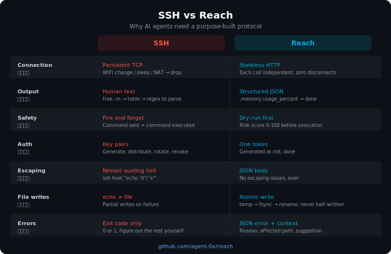

<p align="center">
  
</p>

<h1 align="center">Reach</h1>

<p align="center">
  <strong>Control any server from any AI.</strong><br>
  A lightweight agent for remote server management — no SSH required.
</p>

<p align="center">
  <a href="https://github.com/agent-0x/reach/actions/workflows/ci.yml"></a>
  <a href="https://github.com/agent-0x/reach/releases"></a>
  <a href="LICENSE"></a>
  <a href="https://pkg.go.dev/github.com/agent-0x/reach"></a>
</p>

<p align="center">
  <strong>English</strong> | <a href="README_zh.md">中文</a>
</p>

---

## Why Reach?

- **One binary, one token** — install on a server in 30 seconds, zero config files to manage
- **AI-native** — built-in [MCP](https://modelcontextprotocol.io) server works with Claude Code, Cursor, Windsurf, or any MCP-compatible AI
- **Secure by default** — TLS + token auth + TOFU pinning + command blacklist + fail2ban integration. No SSH keys to rotate.

### How Reach Compares

<p align="center">
  
</p>

Existing tools either target humans (SSH, Tailscale, Teleport) or wrap SSH for AI (losing simplicity). Reach is **purpose-built for AI agents**: one binary, one token, native MCP — no SSH layer in between.

### SSH vs Reach

<p align="center">
  
</p>

## Install

**Give this to your AI and it handles everything:**

```
https://github.com/agent-0x/reach/blob/master/AGENTS.md
```

> Paste the link above into Claude Code, Cursor, or any AI assistant. It will learn how to install and use Reach automatically.

**Or install manually:**

```bash
curl -fsSL https://raw.githubusercontent.com/agent-0x/reach/master/install.sh | bash
```

Or download from [Releases](https://github.com/agent-0x/reach/releases), or build from source:

```bash
git clone https://github.com/agent-0x/reach.git
cd reach && make build
# Binary at ./bin/reach
```

## Quick Start

### 1. Set up the agent (on your server)

```bash
reach agent init --dir /etc/reach-agent
reach agent serve --config /etc/reach-agent/config.yaml
# Copy the token displayed during init
```

> **Tip:** See [Running as a Service](#running-as-a-service) to run the agent in the background.

### 2. Add the server (on your local machine)

```bash
reach add myserver --host 203.0.113.10 --token <token>
# Fingerprint is automatically pinned on first connect (TOFU)
```

### 3. Use it

```bash
reach exec myserver "uname -a"
reach read myserver /etc/hostname
reach upload myserver ./deploy.sh /opt/deploy.sh
```

## AI Integration (MCP)

Reach ships a built-in MCP server so any MCP-compatible AI can manage your servers directly.

### Claude Code

```bash
reach mcp install          # project-level
reach mcp install --global # all projects
# Restart Claude Code — tools are now available
```

Then just ask:

```
You: "Check nginx status on myserver"
AI:  [calls reach_bash("myserver", "systemctl status nginx")]
```

### MCP Tools

| Tool | Description |
|------|-------------|
| `reach_bash` | Execute a shell command |
| `reach_read` | Read a remote file |
| `reach_write` | Write a file (atomic: temp → fsync → rename) |
| `reach_upload` | Upload a local file to the server |
| `reach_info` | Get system info (CPU, memory, disk, uptime) |
| `reach_list` | List all configured servers |
| `reach_stats` | Get detailed system stats (CPU %, memory, disk, network, top processes) |
| `reach_dryrun` | Check if a command is dangerous before executing (risk score 0-100) |

## CLI Reference

| Command | Description |
|---------|-------------|
| `reach agent init [--dir]` | Generate TLS cert + token, write config |
| `reach agent serve [--config]` | Start the HTTPS agent server |
| `reach add <name> --host --token [--port]` | Add a server (TOFU fingerprint pinning) |
| `reach remove <name>` | Remove a server |
| `reach list` | List all configured servers |
| `reach exec <server> <cmd> [-t timeout]` | Run a command remotely |
| `reach read <server> <path>` | Read a remote file |
| `reach write <server> <path>` | Write stdin to a remote file |
| `reach upload <server> <local> <remote>` | Upload a local file |
| `reach download <server> <remote> <local>` | Download a remote file |
| `reach info <server>` | Show system information |
| `reach health <server>` | Check server health |
| `reach mcp install [--global]` | Register as MCP server in Claude Code |
| `reach mcp serve` | Start MCP stdio server (internal) |
| `reach stats <server>` | Show detailed system stats |
| `reach dryrun <server> <cmd>` | Check command risk before executing |

## Architecture

```
┌─────────────────────────────────┐
│  Your Machine                   │
│                                 │
│  Claude Code / Cursor / Gemini  │
│         │ MCP (stdio)           │
│         ▼                       │
│  ┌─────────────┐               │
│  │ reach mcp   │               │
│  │   serve     │               │
│  └──────┬──────┘               │
│         │ HTTPS + Bearer Token  │
└─────────┼───────────────────────┘
          │
          ▼
┌─────────────────────────────────┐
│  Remote Server                  │
│                                 │
│  ┌─────────────┐               │
│  │ reach agent │               │
│  │   serve     │               │
│  └─────────────┘               │
│   :7100 (TLS)                  │
└─────────────────────────────────┘
```

## Security

- **Self-signed TLS + TOFU** — certificate fingerprint pinned on first `reach add`; verified on every subsequent connection
- **128-bit Bearer Token** — generated at `agent init`, transmitted only over TLS
- **Process isolation** — each command runs in its own process group with timeout enforcement
- **Atomic file writes** — temp file → `fsync` → rename; no partial writes
- **Command blacklist** — blocks dangerous commands (`rm -rf /`, `mkfs`, `dd`, fork bombs, etc.)
- **fail2ban ready** — `AUTH_FAIL from <IP>` logged to systemd journal on failed auth

### Configuration

All security features are enabled by default. Customize in your agent's `config.yaml`:

```yaml
security:
  command_blacklist: true
  custom_blacklist:
    - "\\bshutdown\\b"
    - "\\breboot\\b"
  auth_fail_log: true
```

### fail2ban Integration

```ini
# /etc/fail2ban/filter.d/reach-agent.conf
[Definition]
failregex = AUTH_FAIL from <HOST>:
journalmatch = _SYSTEMD_UNIT=reach-agent.service
```

```ini
# /etc/fail2ban/jail.d/reach-agent.conf
[reach-agent]
enabled  = true
backend  = systemd
filter   = reach-agent
maxretry = 3
findtime = 600
bantime  = 3600
banaction = ufw
port     = 7100
```

## Running as a Service

> **Note:** Adjust the `ExecStart` path if you installed reach to a different location (e.g., `~/.local/bin/reach`).

```ini
# /etc/systemd/system/reach-agent.service
[Unit]
Description=Reach Agent
After=network.target

[Service]
ExecStart=/usr/local/bin/reach agent serve --config /etc/reach-agent/config.yaml
Restart=always
RestartSec=5

[Install]
WantedBy=multi-user.target
```

```bash
sudo systemctl daemon-reload
sudo systemctl enable --now reach-agent
```

## Contributing

See [CONTRIBUTING.md](CONTRIBUTING.md) for guidelines.

## License

[MIT](LICENSE)
