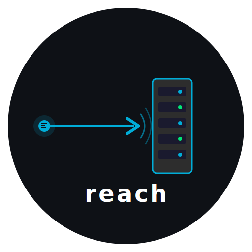
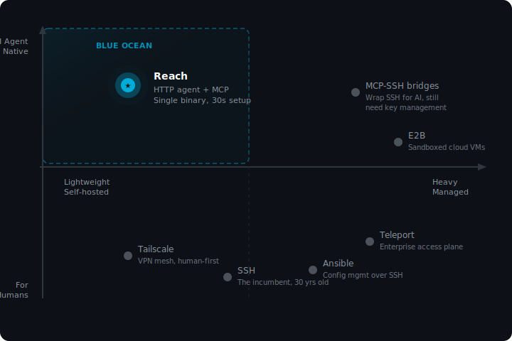

<p align="center">
  
</p>

<h1 align="center">Reach</h1>

<p align="center">
  <strong>从任何 AI 控制任何服务器。</strong><br>
  轻量级远程服务器管理 Agent —— 无需 SSH。
</p>

<p align="center">
  <a href="https://github.com/agent-0x/reach/actions/workflows/ci.yml"></a>
  <a href="https://github.com/agent-0x/reach/releases"></a>
  <a href="LICENSE"></a>
  <a href="https://pkg.go.dev/github.com/agent-0x/reach"></a>
</p>

<p align="center">
  <a href="README.md">English</a> | <strong>中文</strong>
</p>

---

## 为什么选择 Reach？

- **一个二进制，一个 Token** —— 30 秒安装到服务器，零配置文件
- **AI 原生** —— 内置 [MCP](https://modelcontextprotocol.io) 服务器，支持 Claude Code、Cursor、Windsurf 或任何兼容 MCP 的 AI
- **默认安全** —— TLS + Token 认证 + TOFU 指纹锁定 + 命令黑名单 + fail2ban 集成，无需管理 SSH 密钥

### 竞品定位

<p align="center">
  
</p>

现有工具要么面向人类（SSH、Tailscale、Teleport），要么只是给 AI 包了一层 SSH（失去简洁性）。Reach **专为 AI Agent 而生**：一个二进制、一个 Token、原生 MCP —— 中间没有 SSH 层。

## 安装

```bash
curl -fsSL https://raw.githubusercontent.com/agent-0x/reach/master/install.sh | bash
```

也可以从 [Releases](https://github.com/agent-0x/reach/releases) 下载，或从源码构建：

```bash
git clone https://github.com/agent-0x/reach.git
cd reach && make build
# 二进制文件在 ./bin/reach
```

## 快速开始

### 1. 部署 Agent（在远程服务器上）

```bash
reach agent init --dir /etc/reach-agent
reach agent serve --config /etc/reach-agent/config.yaml
# 复制 init 时显示的 Token
```

> **提示：** 参见 [Systemd 部署](#作为服务运行) 以后台服务方式运行。

### 2. 添加服务器（在本地机器上）

```bash
reach add myserver --host 203.0.113.10 --token <token>
# 首次连接时自动锁定证书指纹（TOFU）
```

### 3. 开始使用

```bash
reach exec myserver "uname -a"
reach read myserver /etc/hostname
reach upload myserver ./deploy.sh /opt/deploy.sh
```

## AI 集成（MCP）

Reach 内置 MCP 服务器，任何兼容 MCP 的 AI 都可以直接管理你的服务器。

### Claude Code

```bash
reach mcp install          # 当前项目
reach mcp install --global # 所有项目
# 重启 Claude Code —— 工具即可使用
```

然后直接对话：

```
你：「检查 myserver 上的 nginx 状态」
AI：[调用 reach_bash("myserver", "systemctl status nginx")]
```

### MCP 工具

| 工具 | 说明 |
|------|------|
| `reach_bash` | 执行 Shell 命令 |
| `reach_read` | 读取远程文件 |
| `reach_write` | 写入文件（原子操作：临时文件 → fsync → 重命名） |
| `reach_upload` | 上传本地文件到服务器 |
| `reach_info` | 获取系统信息（CPU、内存、磁盘、运行时间） |
| `reach_list` | 列出所有已配置的服务器 |

## CLI 参考

| 命令 | 说明 |
|------|------|
| `reach agent init [--dir]` | 生成 TLS 证书 + Token，写入配置 |
| `reach agent serve [--config]` | 启动 HTTPS Agent 服务 |
| `reach add <name> --host --token [--port]` | 添加服务器（TOFU 指纹锁定） |
| `reach remove <name>` | 移除服务器 |
| `reach list` | 列出所有已配置的服务器 |
| `reach exec <server> <cmd> [-t timeout]` | 远程执行命令 |
| `reach read <server> <path>` | 读取远程文件 |
| `reach write <server> <path>` | 将 stdin 写入远程文件 |
| `reach upload <server> <local> <remote>` | 上传文件 |
| `reach download <server> <remote> <local>` | 下载文件 |
| `reach info <server>` | 查看系统信息 |
| `reach health <server>` | 健康检查 |
| `reach mcp install [--global]` | 注册为 Claude Code MCP 服务器 |
| `reach mcp serve` | 启动 MCP stdio 服务器（内部使用） |

## 架构

```
┌─────────────────────────────────┐
│  本地机器                        │
│                                 │
│  Claude Code / Cursor / Gemini  │
│         │ MCP (stdio)           │
│         ▼                       │
│  ┌─────────────┐               │
│  │ reach mcp   │               │
│  │   serve     │               │
│  └──────┬──────┘               │
│         │ HTTPS + Bearer Token  │
└─────────┼───────────────────────┘
          │
          ▼
┌─────────────────────────────────┐
│  远程服务器                      │
│                                 │
│  ┌─────────────┐               │
│  │ reach agent │               │
│  │   serve     │               │
│  └─────────────┘               │
│   :7100 (TLS)                  │
└─────────────────────────────────┘
```

## 安全模型

- **自签名 TLS + TOFU** —— 首次 `reach add` 时锁定证书指纹，后续连接验证
- **128 位 Bearer Token** —— `agent init` 时生成，仅通过 TLS 传输
- **进程隔离** —— 每个命令在独立进程组中运行，超时强制终止
- **原子文件写入** —— 临时文件 → `fsync` → 重命名，不会产生半写文件
- **命令黑名单** —— 阻止危险命令（`rm -rf /`、`mkfs`、`dd`、fork bomb 等）
- **fail2ban 就绪** —— 认证失败时记录 `AUTH_FAIL from <IP>` 到 systemd 日志

### 配置

所有安全功能默认启用。在 Agent 的 `config.yaml` 中自定义：

```yaml
security:
  command_blacklist: true
  custom_blacklist:
    - "\\bshutdown\\b"
    - "\\breboot\\b"
  auth_fail_log: true
```

### fail2ban 集成

```ini
# /etc/fail2ban/filter.d/reach-agent.conf
[Definition]
failregex = AUTH_FAIL from <HOST>:
journalmatch = _SYSTEMD_UNIT=reach-agent.service
```

```ini
# /etc/fail2ban/jail.d/reach-agent.conf
[reach-agent]
enabled  = true
backend  = systemd
filter   = reach-agent
maxretry = 3
findtime = 600
bantime  = 3600
banaction = ufw
port     = 7100
```

## 作为服务运行

```ini
# /etc/systemd/system/reach-agent.service
[Unit]
Description=Reach Agent
After=network.target

[Service]
ExecStart=/usr/local/bin/reach agent serve --config /etc/reach-agent/config.yaml
Restart=always
RestartSec=5

[Install]
WantedBy=multi-user.target
```

```bash
sudo systemctl daemon-reload
sudo systemctl enable --now reach-agent
```

## 贡献

参见 [CONTRIBUTING.md](CONTRIBUTING.md)。

## 许可证

[MIT](LICENSE)
